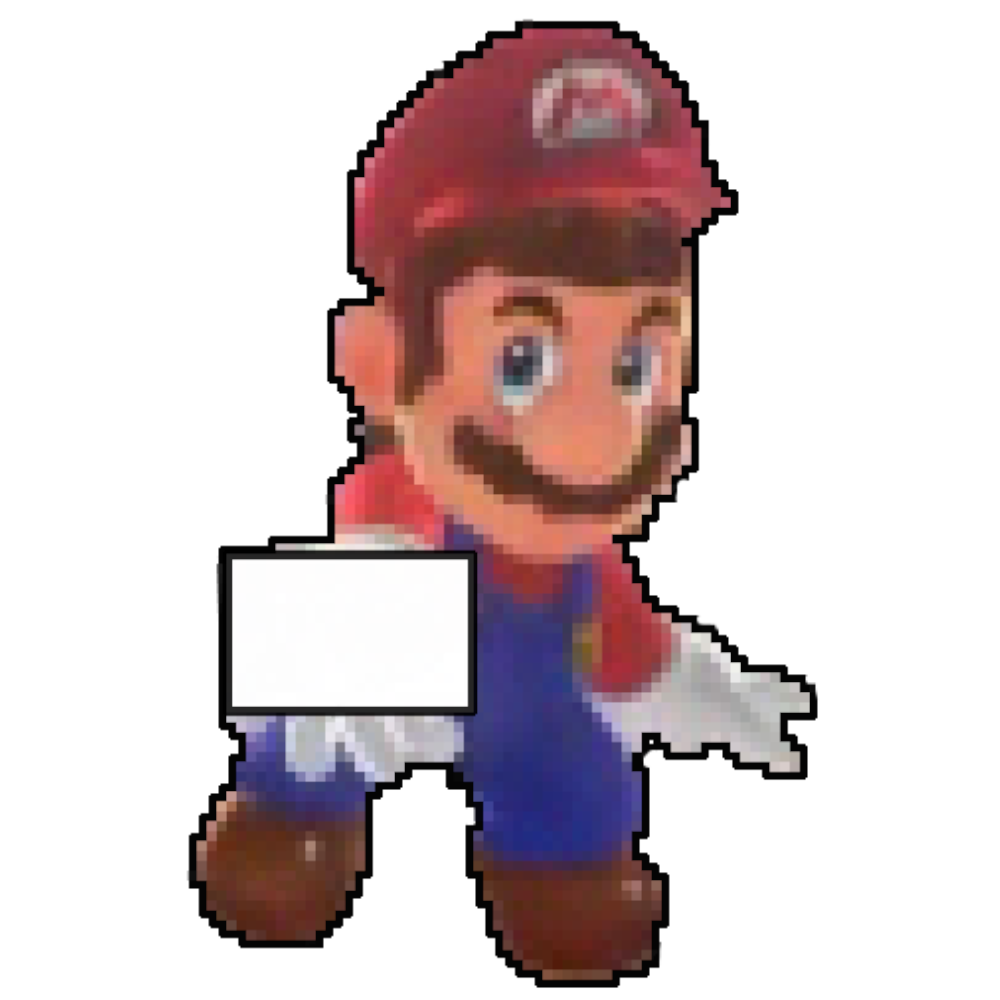

! \mainpage Projekt Problem N Hetmanów 

 
 \section problem_sec Czym jest problem N Hetmanów.
 
Jest to problem szachowy i matematyczny, dotyczący rozmieszczenia N hetmanów na szachownicy o wymiarach N × N. 
Figury muszą być rozłożone w taki sposób, aby wzajemnie się nie szachowały, czyli aby nie znajdowały się w tym samym wierszu, kolumnie, czy ukośnym rzędzie. 
Obok przedstawione są dwa przykładowe rozwiązania problemu dla szachownicy o wymiarach 5 × 5 oraz 4 × 4.

 
 

 \section sposob_sec Sposób działania algorytmu

 Działanie algorytmu polega na tym, że w przypadku niepowodzenia (w całej następnej kolumnie nie ma żadnego wolnego miejsca) to dany hetman jest przenoszony na następne wolne pole, a jeśli nie mógłby być przesunięty dalej, to sprawdzany jest wcześniejszy hetman. 
 Jeśli udało się przesunąć hetmana to algorytm wznawiał pracę. Po ustawieniu hetmana na planszy nadajemy temu polu wartość 1. 
 Przy poszukiwaniu miejsca dla następnego hetmana sprawdzamy, czy to miejsce jest bezpieczne, poprzez sprawdzanie możliwych ruchów hetmana z danego miejsca w lewą stronę planszy. 
 Poniżej przedstawiamy dwie wizualizacje naszego algorytmu.

 <A HREF="https://youtu.be/qDWjeZj0Hpk"> Link do animacji </A>

 W poniższej tabeli przedstawiamy wyniki działania algorytmu dla rozmiarów od 1 do 10.

<table>
   <tr>
    <td>N</td>  <td>1</td> <td>2</td> <td>3</td> <td>4</td> <td>5</td> <td>6</td> <td>7</td> <td>8</td> <td>9</td> <td>10</td> 
   </tr>
   <tr>
   <td>Ilość rozwiązań</td>  
   <td>1</td> <td>0</td> <td>0</td> <td>2</td> <td>10</td> <td>4</td> <td>40</td> <td>92</td> <td>352</td> <td>724</td>
   </tr>
</table>

 \section grafika_sec Szata graficzna projektu 

 Implementacja biblioteki graficznej Allegro poszła po naszej myśli. 
 Teraz na pierwszym ekranie wyświetla nam się mini menu gdzie za pomocą strzałek wybieramy rozmiar szachownicy. 
 Następnie w oknie wyświetla się szachownica na której pokazuje się cała praca algorytmu. 
 Hetmani w postaci księżniczki Peach przechodzą po wszystkich polach szachownicy. 
 Na koniec wyskakuje sam Mario, który wyświetla liczbę wszystkich rozwiązań.

     

 \section zapis_sec Zapis rozwiązań do pliku 
 Aktualnie nasz program podczas pracy zapisuje wszystkie możliwe rozwiązania do pliku w postaci 0 i 1 gdzie 1 oznacza hetmana, a 0 puste pole.

 
 